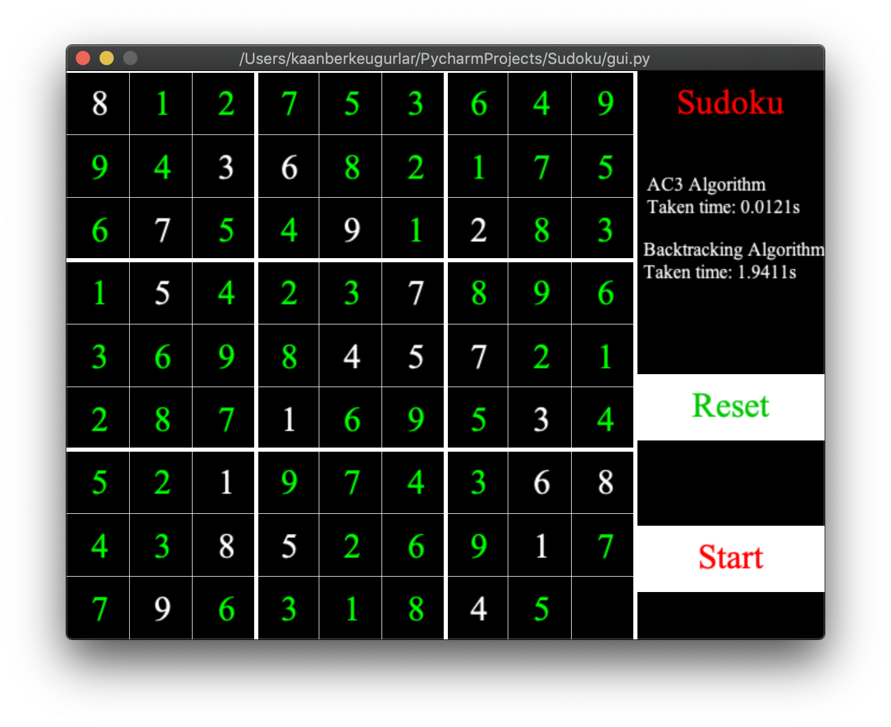

# Sudoku Solver

## Introduction:
#### There are 3 different parts of the project:
* Algorithms
* Main class
* Gui
---

#### Let's inspect them..
* Sudoku puzzles can be solved by using the algorithms below:
    * AC3
    * Backtracking
* main.py takes 2 different parameters:
    * ```py main.pt input.txt output.txt```
    * input file which provides sudoku puzzles' strings..
    * output file which provides the name of the file to write solutions in it.
* GUI:
    * Created by using pyglet
    * Solves sudoku puzzles in input.txt
    * Shows first problem then solution on the board and also taken time.
    * There are just two buttons
        * START
        * RESET

---

#### Dataset
[Kaggle's 1 million sudoku games](https://www.kaggle.com/bryanpark/sudoku) dataset
was used. There are one million sudoku puzzle strings and also their solutions
in the dataset.

---

## Installation & Running

First install the requirements.

```
pip install -r requirements.txt
```

Then
* if you.wantToRun('main.py'):
    * ```
      py main.py input.txt output.txt
      ```
* elif you.wantToRun('GUI'):
    * ```
      py gui.py
      ```
* else:
    * ```
      exit
      ```
<<<<<<< HEAD
      
## Screenshot(s)

#### Sudoku puzzle problem sample:


#### Sudoku puzzle solution sample:

=======
